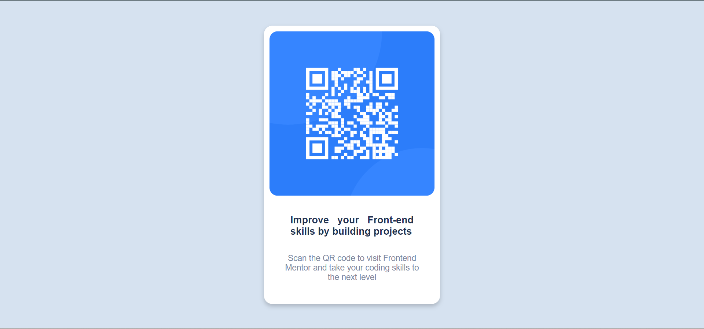

# Frontend Mentor - QR code component solution

This is a solution to the [QR code component challenge on Frontend Mentor](https://www.frontendmentor.io/challenges/qr-code-component-iux_sIO_H). Frontend Mentor challenges help you improve your coding skills by building realistic projects. 

## Table of contents

- [Overview](#overview)
  - [Screenshot](#screenshot)
  - [Links](#links)
- [My process](#my-process)
  - [Built with](#built-with)
  - [What I learned](#what-i-learned)
  - [Continued development](#continued-development)
  - [Useful resources](#useful-resources)
- [Author](#author)
- [Acknowledgments](#acknowledgments)


## Overview

### Screenshot



### Links

- Solution URL: [https://github.com/Mauludinegi/QR-Code-Page]
- Live Site URL: [https://mauludinegi.github.io/QR-Code-Page/]

## My process

### Built with

- Semantic HTML5 markup
- CSS custom properties
- CSS Flexbox
- CSS Position
- Mobile-first workflow


### What I learned

In this challenge, I've been learned such increadible stuff of CSS. For the first, I don't know about css can make card layout such a beatiful like that. Even though, I can't believe that I through this challenge and build something that make my spirit increase for the next challenge. I hope this challenge can motivate others and be my first step to becoming Fullstack Web Development. By the way, this is my first challenge so if there some words not correct or not supposed to be wrote I apologize.

I believe someday I get what I want and I Swear to god, peace✌️; 

these are my code snippets that I used in this challenge, check this out:

```html
<head>
<meta name="author" content=""/>
<meta name="description" content="">
<link rel="icon" type="image/png" sizes="" href="">
</head>
```
```css
.card {
  background-color: var();
  box-shadow: 0 4px 8px 0 rgba(0, 0, 0, 0.2);
  width: 320px;
  border-radius: 15px;
}

.card:hover {
  box-shadow: 0 8px 16px 0 rgba(0, 0, 0, 0.2);
}
```

### Continued development
After completed this challenge, I realize still not good at CSS, especially when hit grid and position part. I don't know how position work and when to use it. I geuss that two part will be my focusing on the next learning projects. Wish me luck.


### Useful resources

- [1](https://www.w3schools.com/css/) - This helped me for learn CSS stuff. I really liked this pattern and will use it going forward.
- [2](https://developer-mozilla-org.translate.goog/en-US/docs/Web/CSS/) - This is an amazing resource which provide reading materials fully completed. I'd recommend it to anyone who still learning concept of css.


## Author

- Website - [Mauludinegi](www.linkedin.com/in/mauludinegi)
- Frontend Mentor - [@Mauludinegi](https://www.frontendmentor.io/profile/Mauludinegi)


## Acknowledgments

I'd like to thank you for everyone who supported me. I hope that support not break and still continue in the future. Also, thank for channel youtube and website that provide knowledge so I can learn from there. The list channel youtube that I learn from: WPU, Programmer Zaman Now, and FreeCodeCamp. For Website like w3school and MDN mozila developer.
